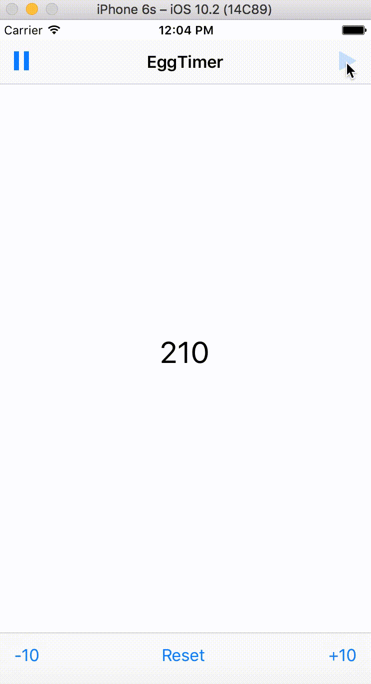

# EggTimerApp

## Background
This is the fourth Swift App I have ever built. This app represents my first time using globally scoped variables in Swift. It is also my first time using navbars for a cleaner UI. 

## Course
The project was taken from a Udemy Intro to App Development course. More information on the course can be found at [Udemy](https://www.udemy.com/complete-ios-10-developer-course/learn/v4/content)

## Demo

